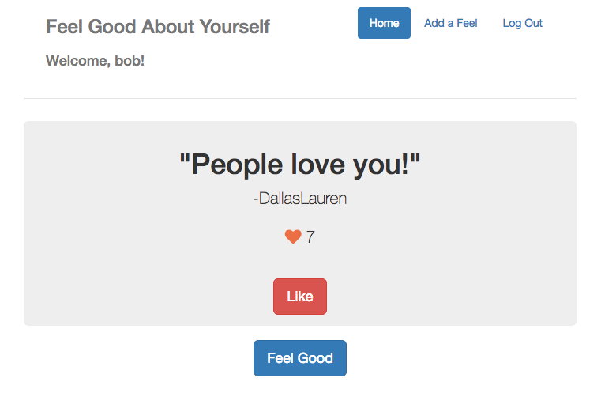
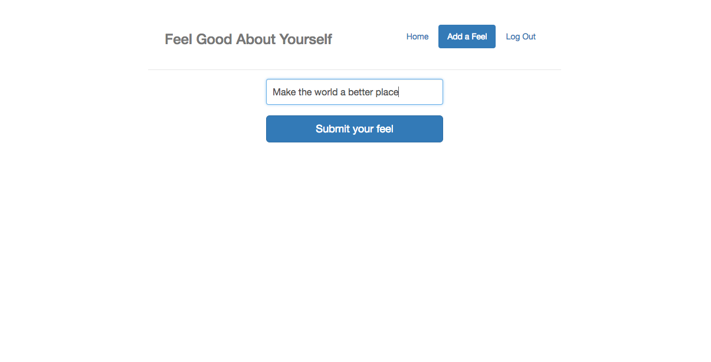

# Feel Good About Yourself v2
The most positive web app you will ever use.

### Feel Good About Yourself v2
* Live Demo: https://feel-good.herokuapp.com/
* GitHub: You've already found it!

### Feel Good About Yourself v1
* Live Demo: https://infinite-ravine-73596.herokuapp.com/#/?_k=42f42z
* GitHub: https://github.com/surbhiposwalia/FeelGoodAboutYourself

## API Documentation

* /users
	* GET: get all the users
	* POST: post a new user to the database
* /users/`username`
	* GET: get a specific username
* /feels
	* GET: get all the feels
	* POST: post a new feel to the database
* /feels/`feelId`
	* PUT: increase the number of likes from that specific feel by 1

## But Mat, why did you make this?

* I want to make the world a better place.
* If I can put a smile on someone's face, my job is done.
* Feel Good About Yourself was designed to, well, feel good about yourself...
* Anyone can submit something nice and make the world happier.
* Spead love not hate.

## Easy start up guide
* If you just want to look at some feels, the only thing you have to do is click the `feel good` button. Congratulations, you did it.
* If you wish to contribute a feel, you must register and sign in to your account. After you have successfully signed in, simply press the `Add a Feel` button, type a happy, positive message and then press `Submit your feel`. Easy!

## Technical

The frontend of this app is developed in React/Redux while the backend uses MongoDB and Node.js. The CSS was seamlessly made using bootstrap and sass. Async actions are dispatched to retrieve and update information from the database. As you register your account, your password is secured from a hashing algorithm using the bcrypt library. We won't hack you. Promise.

# Thank you <3